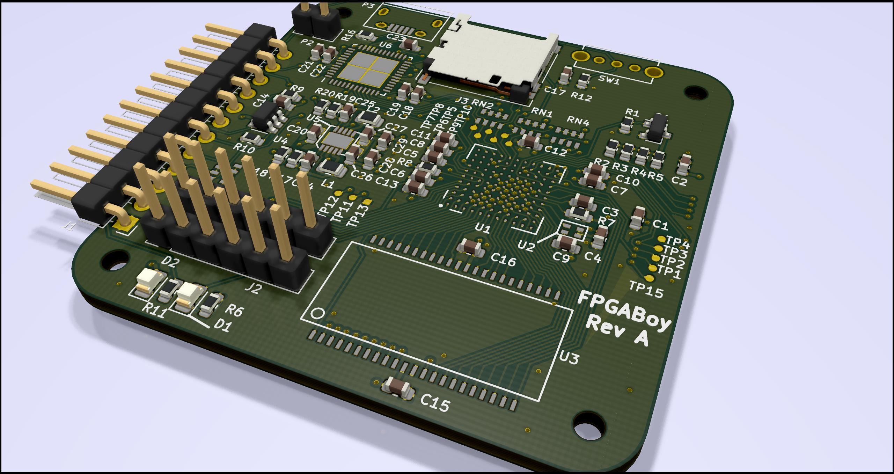

RISCBoy
=======

RISCBoy is an open-source portable games console, designed from scratch. This includes:

- A RISC-V compatible CPU
- A raster graphics pipeline and display controller
- Other chip infrastructure: busfabric, memory controllers, UART, GPIO etc.
- A PCB layout in KiCad


It is a Gameboy Advance from a parallel universe where RISC-V existed in 2001. A love letter to the handheld consoles from my childhood, and a 3AM drunk text to the technology that powered them.

The design is written in synthesisable Verilog 2005, and is intended to fit onto an iCE40-HX8k FPGA. This is a LUT4-based FPGA with 7680 logic elements, so fitting a 32 bit games console requires a crowbar and some vaseline, or perhaps just careful design. The HX8k was once the largest FPGA targeted by the open-source [Icestorm](http://www.clifford.at/icestorm/) FPGA toolchain, but that toolchain has since [moved on](https://github.com/SymbiFlow/prjtrellis) to [greater things](https://github.com/SymbiFlow/prjxray).

More detailed information can be found in the [documentation](doc/riscboy_doc.pdf).

The processor supports the RV32IMC instruction set, and passes the RISC-V compliance suite for these instructions, as well as the [riscv-formal](https://github.com/SymbioticEDA/riscv-formal) verification suite, and some of my own formal property checks for instruction frontend consistency and basic bus compliance. It also supports M-mode CSRs, exceptions, and a simple compliant extension for vectored external interrupts.

Cloning
-------

**This repository uses submodules for HDL as well as tests**

```
git clone --recursive https://github.com/Wren6991/RISCBoy.git riscboy
```

Alternatively

```
git clone https://github.com/Wren6991/RISCBoy.git riscboy
cd riscboy
git submodule update --init --recursive
```

Note a recursive submodule update is required to run the processor's standalone tests. This is not necessary for building RISCBoy gateware.

Building RV32IC Toolchain
-------------------------

The RV32IC toolchain is required for compilation of software-based tests. Follow the instructions on the [RISC-V GNU Toolchain GitHub](https://github.com/riscv/riscv-gnu-toolchain), except for the configure line:

```
$ ./configure --prefix=/opt/riscv --with-arch=rv32ic --with-abi=ilp32
$ sudo mkdir /opt/riscv
$ sudo chown $(whoami) /opt/riscv
$ make -j $(nproc)
```

Simulation
----------

The simulation flow is driven by Xilinx ISIM 14.x; makefiles are found in the scripts/ folder. This has only been tested with the Linux version of ISIM.

You will also need to checkout the RISC-V compliance suite in order to run these tests (note the `-- test` is required to stop git from looking in the KiCad directories and complaining about the library structure there).

```
$ git submodule update --init --recursive
```

Once this is ready, you should be able to run the following:

```
$ . sourceme
$ cd test
$ ./runtests
```

which will run all of the HDL-level tests. Software tests will require the RV32IC toolchain. You may need to adjust some of the paths in `sourceme` if ISIM is installed in a non-default location. To graphically debug a test, run its makefile directly:

```
$ cd system
$ make TEST=helloworld gui
```

PCB
---

The image shows the Rev A PCB. It is compatible with iTead's 4-layer 5x5 cm prototyping service, which currently costs $65 for 10 boards.



The schematic can be viewed [here (pdf)](board/fpgaboy.pdf)

Rev B will look quite different; I am waiting for the gateware and bootloader to mature before proceeding. My current dev hardware looks a lot like my [Snowflake FPGA board](https://github.com/Wren6991/Snowflake-FPGA).

Synthesis
---------

FPGA synthesis for iCE40 uses an open-source toolchain. If you would like to build this project using the existing makefiles, you will first need to build the toolchain I used:

- [Yosys](https://github.com/yosyshq/yosys) for synthesis
- [nextpnr](https://github.com/YosysHQ/nextpnr) for place and route
- [Project Icestorm](http://www.clifford.at/icestorm/) for bitstream generation

Note that I have only built these on Linux. I've heard it is possible to build these on Windows, but haven't tried it. However, they can be built on a Raspberry Pi, which is neat.

Once the toolchain is in place, run

```
$ . sourceme
$ cd synth
$ make -f HX8k-EVN.mk bit
```

to generate an FPGA image suitable for Lattice HX8k evaluation board.

There is also highly experimental support (i.e. not my main dev platform) for ECP5, with board files for the Lattice LEF5UM5G-85F-EVN evaluation board:

```
$ make -f ECP5-EVN.mk BUILD=full bit
```

This build replaces the external, 512 kiB, 16 bit wide SRAM of RISCBoy development hardware with an internal, 256 kiB, 32 bit wide synchronous memory, which Trellis builds out of ECP5 sysmem blocks.

Directory Structure
-------------------

- `board`: KiCad files for main RISCBoy PCB and other small boards used during development
- `doc`: LaTeX source and diagrams for documentation, and the most recently built PDF
- `hdl`: The Verilog source for RISCBoy gateware.
	- `busfabric`: AHB-lite crossbar and APB peripheral fabric
	- `graphics`: Source for the pixel processing unit
	- `hazard5`: Source for the RISC-V processor. This is completely self-contained.
	- `mem`: Memory controllers, and inference/injection wrappers and models for the memories themselves
	- `peris`: Small peripherals such as UART, SPI, PWM
	- `riscboy_core`: Structural module to instantiate and connect the components that comprise RISCBoy
	- `riscboy_fpga`: Top-level wrappers for a few different FPGAs and boards: connect up IOs, provide clock and reset
- `reference`: a few PDFs for standards used in RISCBoy, e.g. the RISC-V instruction set
- `scripts`: Junk that I can't put anywhere else
- `software`: Loose collection of C files that are used for system-level tests. Not really a useful software tree yet.
- `synth`: Working directory for running whole-system synthesis. Top-level makefiles, pin constraint files.
- `test`: Regression tests. Some are Verilog testbenches, others are software testcases that run on simulations of the processor or the full system.
