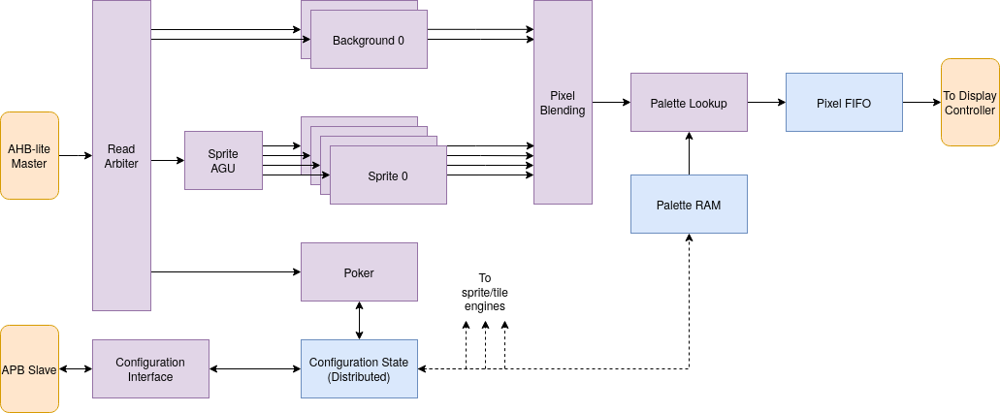

PPU v1
======

This is my first attempt at a pixel processing unit for RISCBoy. You can read a ton of details in [this old version of the documentation](https://github.com/Wren6991/RISCBoy/raw/72e1fb6542169629aa393b0dd79aa415e750abe7/doc/riscboy_doc.pdf). I am happy with how the implementation turned out, but think I made the wrong set of architectural tradeoffs early on.

This architecture has a number of independent tile and sprite engines, operating in parallel, with shared bus access. This leads to many idle functional units on most cycles, and an aggressively pared-down feature set to shoehorn the whole lot into 1/3 of an iCE40. It's still a fine PPU for many purposes, and I'm particularly fond of the Poker, which is probably why I stuck with this architecture for so long.

The new PPU will have a single, high-throughput programmable blitter, which should squeeze more performance and fun from the same LUTs.