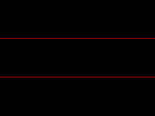

PPU Testcases
-------------

These testcases are run against a PPU cycle model generated from the PPU's Verilog source with [CXXRTL](https://tomverbeure.github.io/2020/08/08/CXXRTL-the-New-Yosys-Simulation-Backend.html), in a C++ testbench containing a memory and a virtual display output. Each testcase is one directory:

- Any files named `(addr).S` are assembled and appear in the testbench memory at address `(addr)`, where `(addr)` is a number of any base
- Any files named `sprite_(addr)_(format).png` (can be any image file extension) will be packed with pixel format `(format)` (any of argb1555, p8, p4, p1) and appear in the testbench memory at address `(addr)`.
- Files named `tile8_(addr)_(format).png` or `tile16_(addr)_(format).png` are treated similarly, except the pixels are packed as a tileset, rather than a single large image.
- Files named `asset_(addr).bin` (file extension unimportant) are copied directly into the program image, and appear in the testbench memory at address `(addr`)

The maximum program image size is 16 MiB. The testbench vectors the PPU command processor to address `0`, so generally each testcase directory will at least contain an assembly file called `0.S` containing the program entry point. For example, the `fill_with_branch` testcase consists of two files, one of them called `0.S`, and containing the following:

```
	clip 0, 319

loop1:
	fill 31, 0, 0
	sync
	push loop1
	popj ylt 80

loop2:
	fill 0, 31, 0
	sync
	push loop3
	popj yge 160
	push loop2
	popj

loop3:
	fill 0, 0, 31
	sync
	push loop3
	popj
```

The second file in the `fill_with_branch` directory is an image called `expected_output.png`. This is used to check testcase success, and one file with this name must appear in every testcase directory.


The program image is loaded into the C++ testbench and executed. The PPU's output is dumped to an image file, which is compared with the expected output. If the PPU fails to produce the required image, the test scripts create a file called `invalid_mask.png` in the test directory. For example, if the `y` comparisons were off by one, this would be the result:



